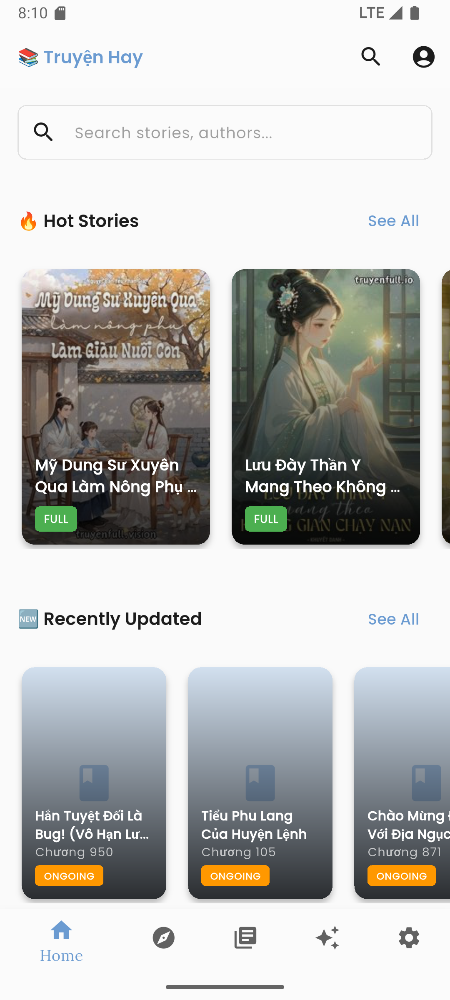
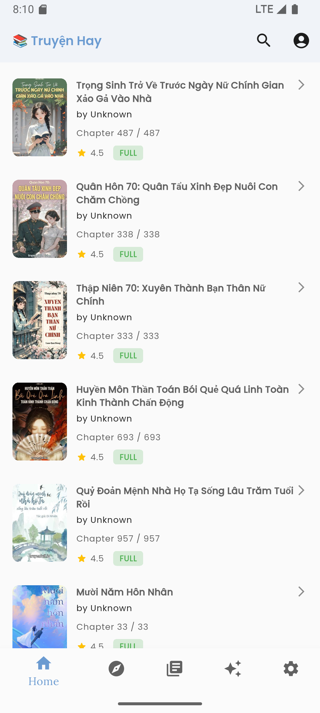
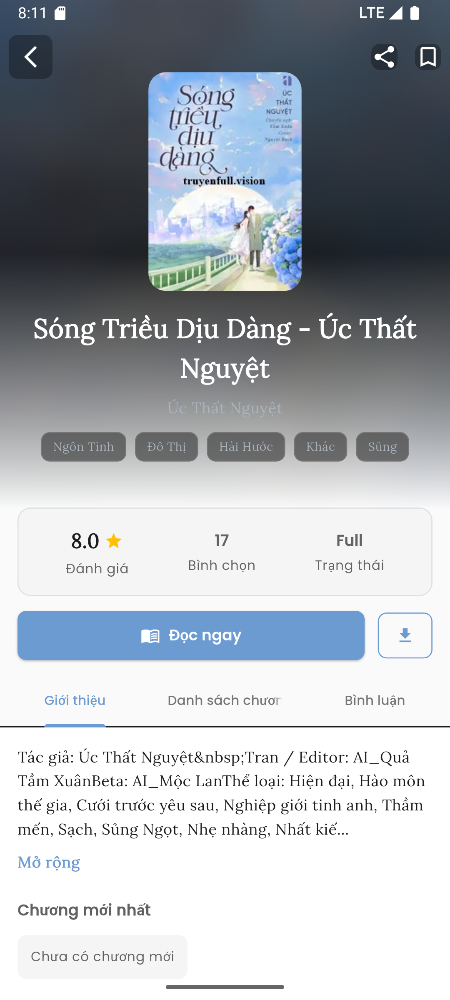
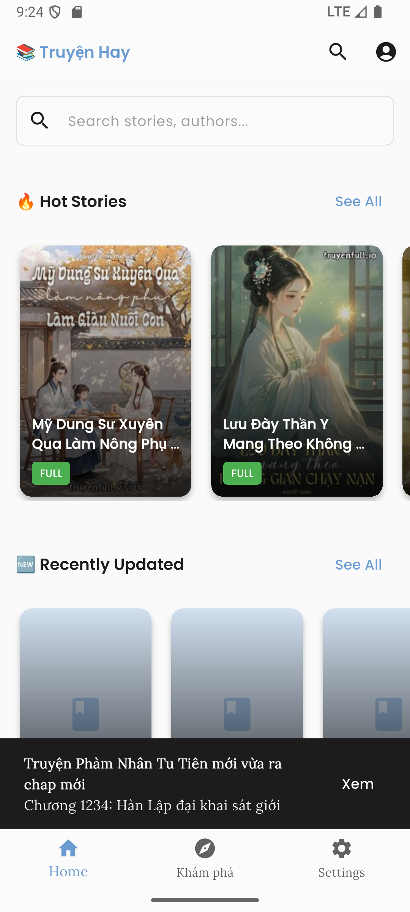
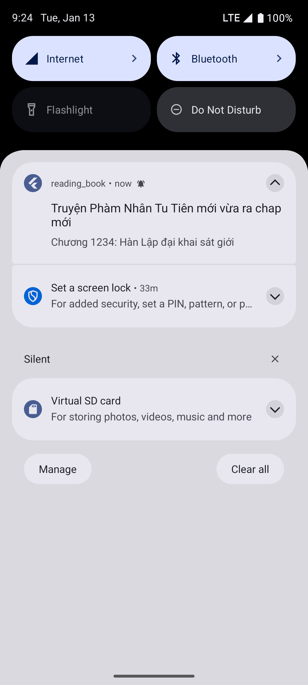

<h1 align="center">Truyện Hay</h1>

<p align="center">Ứng dụng đọc sách điện tử được phát triển bằng Flutter.</p>

<p align="center">
  
  
  
</p>

## Tính năng

- 📚 Thư viện sách đa dạng
- 🔖 Đánh dấu trang
- 🔔 Thông báo
- 👤 Quản lý tài khoản

## Cài đặt

```bash
# Clone repository
git clone <repository-url>

# Di chuyển vào thư mục dự án
cd reading_book

# Cài đặt dependencies
flutter pub get

# Chạy ứng dụng
flutter run
```

## Yêu cầu

- Flutter SDK
- Dart SDK
- Android Studio / Xcode (cho development)

## Công nghệ sử dụng

- Flutter
- Firebase Messaging
- Provider/Bloc (State Management)

## Screenhots
Firebase Messaging
<p align="center">
  
  
</p>

## License

This project is licensed under the MIT License.
